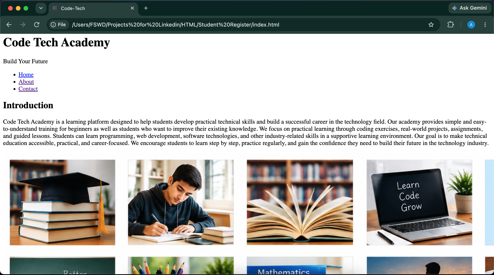
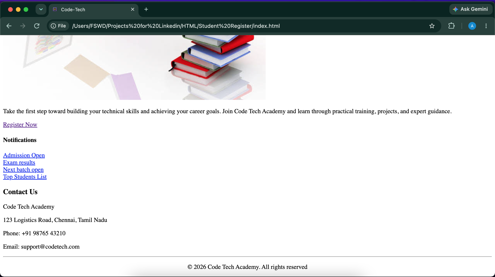

# My Portfolio

A simple personal portfolio website created using HTML to practice and demonstrate my understanding of HTML tags and basic webpage structure.

## 📌 About the Project

This project is a beginner-level personal portfolio website. I created this project to practice using different HTML tags and to understand how to structure a complete webpage.

The website presents basic information about me, my skills, projects, and other personal details.

## ✨ Features

* Personal introduction
* About Me section
* Skills section
* Projects section
* Contact section
* Use of different HTML tags
* Basic navigation using HTML links
* Structured webpage layout

## 📸 Screenshots

### Home Page

### About Page

### Contact Page

## 🛠️ Technologies Used

* HTML5

## 🎯 Purpose of the Project

The main purpose of this project is to practice:

* HTML tags
* Headings and paragraphs
* Lists
* Links
* Images
* Forms
* Page structure
* Semantic HTML elements

## 🚀 How to Run

1. Download or clone this repository.
2. Open the project folder.
3. Open the `index.html` file in any web browser.

No additional installation is required.

## 🔗 GitHub Repository

[My Portfolio](https://github.com/arivudurga835/HTML_portfolio.git)

## 👨‍💻 Author

**Arivukkarasan J**

This is one of my beginner HTML projects created while learning Web Development.
